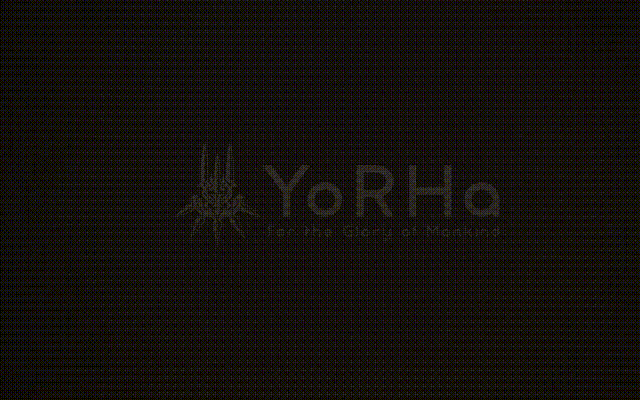

# Nier Automata Screen Boot for Plymouth
## yorha-loading-screen-boot-plymouth
este es un screen boot configurado para que inicie con la pantalla de carga de yorha nier automata al inicio del juego




te dejo la ruta donde pegarla rapidamente

```bash
echo "Creamos la carpeta contenedora"
sudo mkdir /usr/share/plymouth/themes/nier
echo "-----------------------------------------"
echo "clonamos"
sudo git clone https://github.com/RgeditV1/Nier-Automata-ScreenBoot.git /usr/share/plymouth/themes/nier
```
